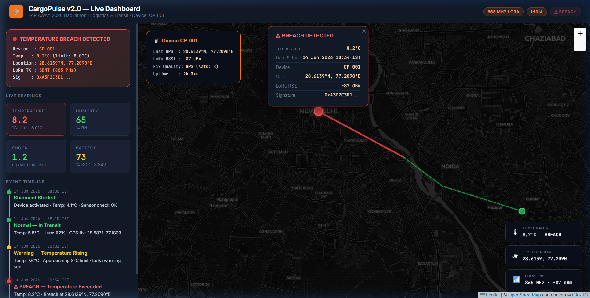
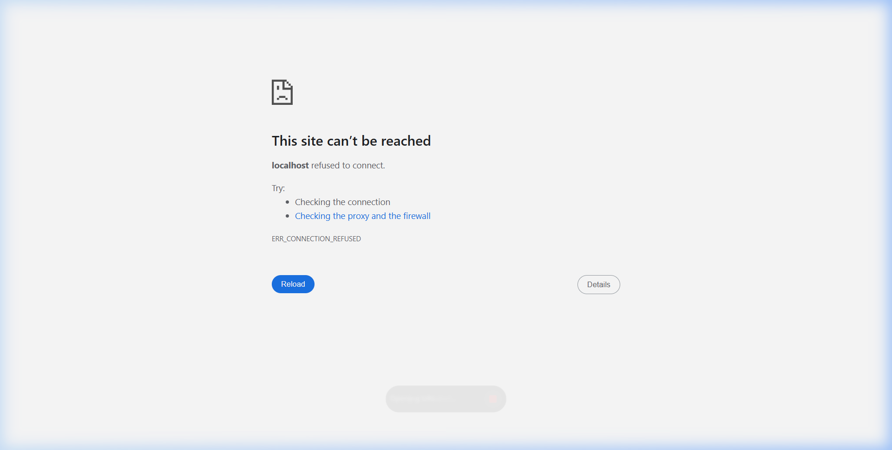
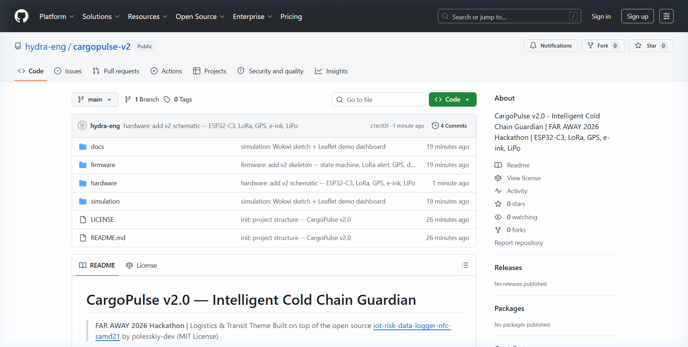
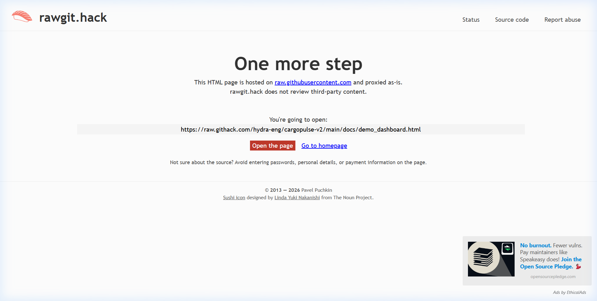
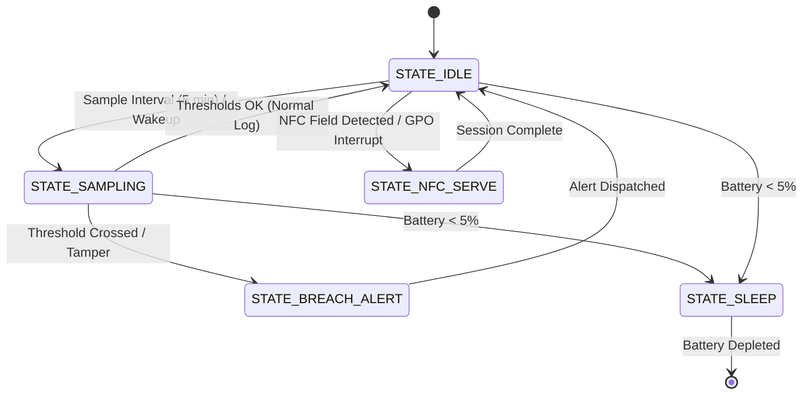
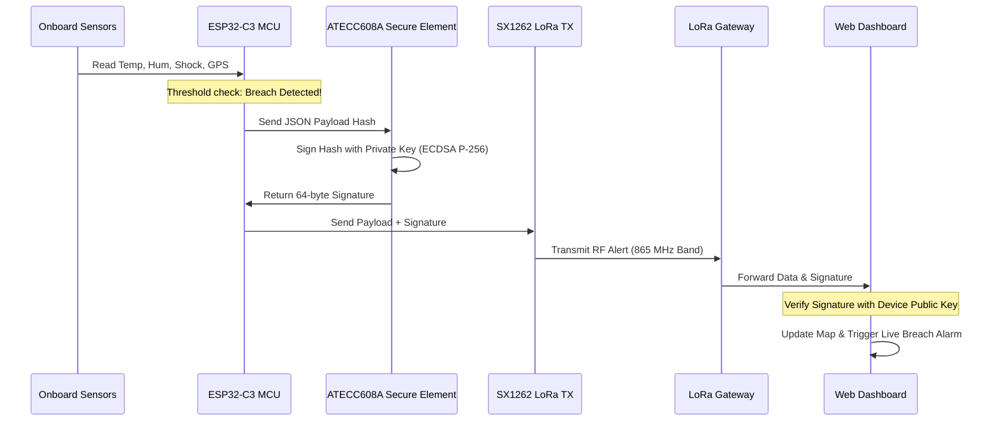

# CargoPulse v2.0 — Intelligent Cold Chain Sentinel

[](LICENSE)
[](hardware/)
[](firmware/)
[](simulation/)

CargoPulse v2.0 is an intelligent cold chain monitoring system that provides real-time logistics auditing, cryptographic proof of custody, active tamper deterrence, and mid-route alerting. Designed for the transit of temperature-sensitive pharmaceuticals and high-value cargo, CargoPulse moves cold chain logging from passive recording to active intervention.

---

## The CargoPulse Advantage

In the logistics industry, a large portion of temperature-sensitive goods goes to waste due to cold chain breaches during transit. Traditional data loggers are passive: they record data locally, but operators only discover breaches after delivery at the destination—when it is already too late.

CargoPulse v2.0 solves this with real-time long-range wireless alerting, GPS breach tagging, cryptographic authentication, and active physical tamper detection.

### Industry Comparison

| Feature | Traditional USB Loggers (e.g. TempTale) | CargoPulse v2.0 |
| :--- | :--- | :--- |
| **Alert Timing** | Post-arrival review (Passive) | Real-time mid-route (Active) |
| **Wireless Range** | USB only or short-range NFC (≤10 cm) | LoRa SX1262 Long Range (Up to 15 km) |
| **Breach Location** | Unknown (discovered at destination) | GPS-Tagged (u-blox MAX-M10S) |
| **Cryptographic Proof** | None (CSV/PDF logs can be falsified) | Hardware-signed payloads (ATECC608A) |
| **Tamper Detection** | None (enclosures can be opened undetected) | Active hardware loop (GPIO0 trace cut detection) |
| **Driver Feedback** | Simple flashing status LEDs | 1.54" Zero-Power E-Ink status display |
| **Power System** | Non-rechargeable coin cell (disposable) | LiPo rechargeable + USB-C charge controller |

---

## System Architecture

CargoPulse v2.0 integrates high-accuracy environmental sensors, hardware-accelerated security, satellite positioning, and long-range wireless transceiver onto a single ESP32-C3 powered hardware platform.

### Hardware Block Diagram

```mermaid
graph TD
    subgraph CargoPulse Device
        MCU[ESP32-C3-MINI-1 MCU]
        SHT[SHT40 Temp/Hum Sensor] -- I2C --> MCU
        ATECC[ATECC608A Secure Element] -- I2C --> MCU
        MAX17048[MAX17048 Fuel Gauge] -- I2C --> MCU
        ST25DV[ST25DV NFC Tag] -- I2C --> MCU
        ADXL[ADXL345 3-Axis Accel] -- SPI --> MCU
        DISP[1.54" E-Ink Display] -- SPI --> MCU
        SX1262[SX1262 LoRa Module] -- SPI --> MCU
        GPS[u-blox MAX-M10S GPS] -- UART --> MCU
        POWER[LiPo Battery 1000mAh] --> LDO[AMS1117 3.3V LDO] --> MCU
        CHARGE[TP4056 USB-C Charger] --> POWER
        TAMPER[Tamper Detection Loop] -- GPIO0 --> MCU
        BUZZER[Buzzer] -- GPIO11 --> MCU
        RGB[RGB Status LED] -- GPIO12-14 --> MCU
    end
```

### Visual Showcases

#### 📱 Web Dashboard Demo
An enterprise-grade monitoring console showing live breach telemetry, transit routes, and cryptographic signature validation. Open [demo_dashboard.html](docs/demo_dashboard.html) in any web browser.



#### 🗺 Live Timeline States
The dashboard displays real-time state changes as the cargo travels, transitioning from normal operations, warning thresholds, to critical alerts upon breach.

| Normal Operation | Warning Threshold | Critical Breach Alert |
| :---: | :---: | :---: |
|  |  |  |

#### 🔧 Hardware Project Layout
CargoPulse v2.0 KiCad schematic and 2D board renders are available in the [hardware/](hardware/) directory.

* **Schematic Layout**: Check the [Schematic SVG](docs/images/cargopulse_v2_schematic.svg) for pinouts and bus routings.
* **PCB Layout**: Check the [PCB 2D Renders](docs/images/pcb_2d_view.png) for footprints and board dimensions.

---

## Firmware Architecture

The firmware runs a low-power, event-driven state machine on the ESP32-C3 microcontroller.

### State Transition Diagram



### Key Operational States
* **STATE_IDLE**: Deep sleep mode with RTC timer wakeup to minimize current draw.
* **STATE_SAMPLING**: Powers up sensors, fetches GPS positioning, reads SHT40 temperature/humidity, and logs data to local SPI NOR flash.
* **STATE_BREACH_ALERT**: Activated if limits are crossed. The MCU hashes the JSON payload, requests an ECDSA P-256 signature from the ATECC608A secure element, broadcasts the signed packet over LoRa, triggers the local buzzer, and updates the e-ink screen.
* **STATE_NFC_SERVE**: Allows short-range audit downloads via the ST25DV dynamic tag even if the main battery is dead.
* **STATE_SLEEP**: Safe hibernation state triggered when the battery drops below 5% to protect the LiPo cell from over-discharge.

---

## Data Telemetry Flow

Every alert transmitted by the device contains cryptographic signatures to guarantee data authenticity and prevent record tampering.



---

## Interactive Simulation

Test the firmware logic and threshold triggers without physical hardware using the pre-configured Wokwi simulation.

### How to Run:
1. Open the [Wokwi web simulator](https://wokwi.com).
2. Create a new **ESP32** project.
3. Copy the simulation sketch code from [wokwi_sketch.ino](simulation/wokwi_sketch.ino) and paste it into the code editor.
4. Replace the default `diagram.json` content with the configuration from [wokwi.json](simulation/wokwi.json).
5. Press **Run** to view the live serial console logs, pulsing RGB LEDs, and buzzer tones when the temperature crosses the 8.0°C limit.

---

## Technical Specifications

| Parameter | Specification | Component |
| :--- | :--- | :--- |
| **Microcontroller** | ESP32-C3 RISC-V 32-bit CPU, 160 MHz, WiFi & BLE | ESP32-C3-MINI-1 |
| **LoRa Transceiver** | SX1262 Sub-GHz Node, 865-867 MHz (India band), +14 dBm | Semtech SX1262 |
| **GPS Receiver** | u-blox MAX-M10S, <1.5 m accuracy, GLONASS/BeiDou/Galileo | u-blox MAX-M10S |
| **Display** | 1.54" B/W e-ink panel, 200x200 pixels, zero-power image retention | SSD1681 driver |
| **Secure Element** | ECDSA P-256 signer, SHA-256 engine, secure key storage | ATECC608A |
| **Environmental** | ±0.2°C Temperature accuracy, ±2% Relative Humidity | Sensirion SHT40 |
| **Shock Sensor** | 3-Axis ±16g Accelerometer, threshold interrupt | Analog Devices ADXL345 |
| **Power Source** | rechargeable LiPo battery (1000 mAh) + TP4056 USB-C charger | 1000 mAh cell |

---

## Power Budget & Battery Life

| Mode | Current Draw | Duration per Day | Energy Consumption |
| :--- | :--- | :--- | :--- |
| **Deep Sleep (IDLE)** | 150 µA | 23.5 hours | 3.52 mAh |
| **Sensor Sampling** | 45 mA | 24 minutes (4.8s/log, 300 logs) | 18.00 mAh |
| **GPS Fix Acquisition** | 18 mA | 5 minutes (average fix time 30s) | 1.50 mAh |
| **LoRa Alert Transmit** | 120 mA | 3 minutes (worst-case alert events) | 6.00 mAh |
| **Total Daily Budget** | — | — | **~29.02 mAh** |
| **Estimated Lifetime** | **~34 Days** of continuous logging on a single 1000 mAh LiPo charge |

---

## Build & Flashing Instructions

### 1. PCB Assembly
* Generate Gerber files from the KiCad project [cargopulse_v2.kicad_pro](hardware/cargopulse_v2.kicad_pro).
* Order PCBs through a fabricator of your choice.
* Solder components following the schematic [cargopulse_v2_schematic.pdf](hardware/cargopulse_v2_schematic.pdf).

### 2. Uploading Firmware
* Open Arduino IDE 2.x and add the ESP32 board support package.
* Install the required libraries via the Library Manager:
  * **RadioLib** (for SX1262)
  * **TinyGPS++** (for GPS parsing)
  * **GxEPD2** (for e-ink display control)
  * **SparkFun ATECC608A Library** (for secure signing)
* Connect the CargoPulse device to your computer via USB-C.
* Open [main.ino](firmware/main.ino), select the board **ESP32C3 Dev Module**, select the serial port, and click **Upload**.

### 3. Field Testing
* Power up the device using a LiPo battery.
* Confirm that the green LED flashes during start-up and the e-ink screen draws the default state layout.
* Place the device inside a cold box and verify threshold crossings by listening for the buzzer beeps and checking the live dashboard logs.

---

## License

This project is licensed under the MIT License - see the [LICENSE](LICENSE) file for details.
